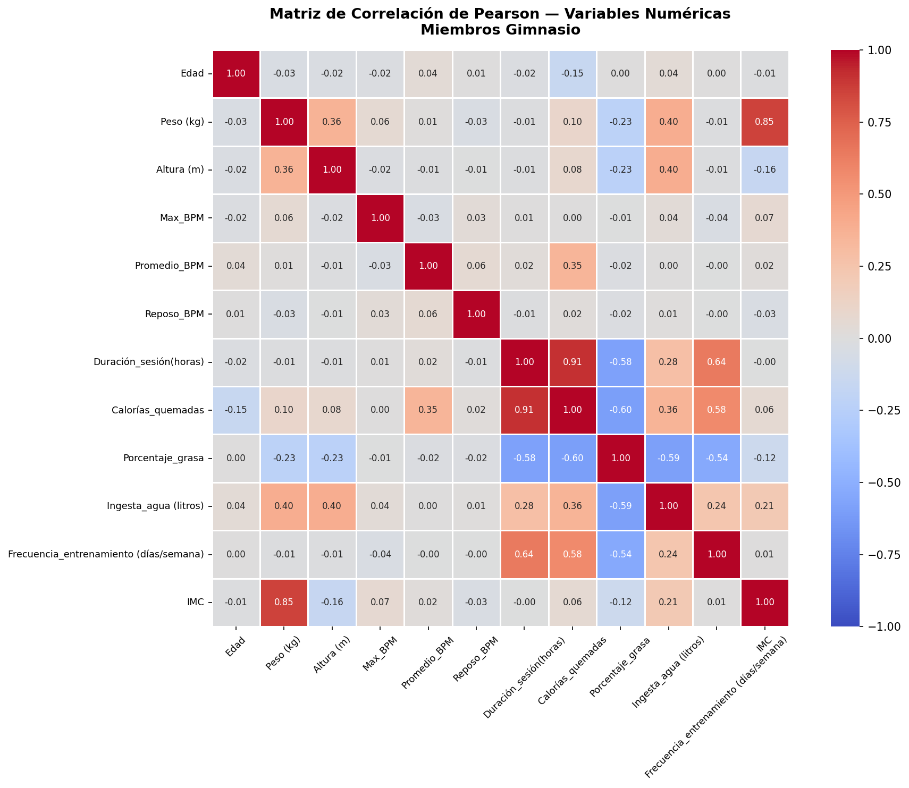
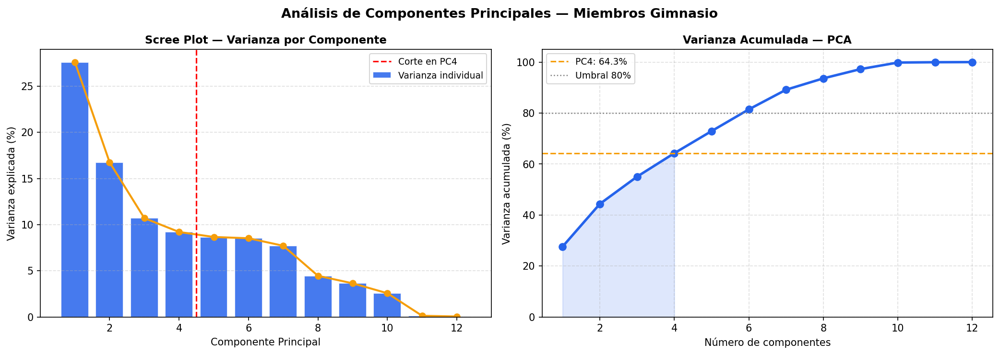
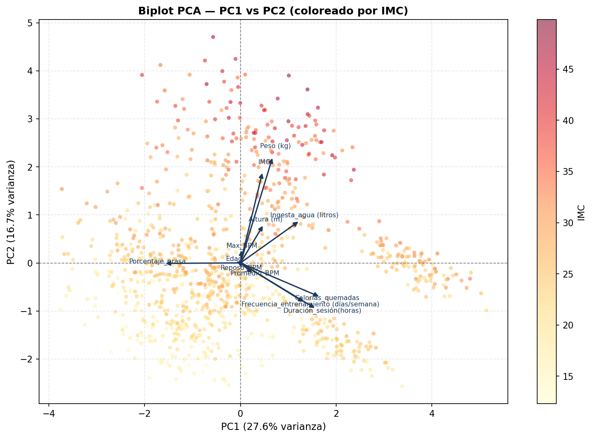

# 🏋️ Análisis multivariado: miembros de gimnasio

Análisis exploratorio, de correlaciones y de componentes principales (PCA) sobre **961 miembros de gimnasio y 16 variables** (edad, medidas corporales, frecuencia cardíaca, duración y frecuencia de entrenamiento, calorías, grasa corporal e hidratación). Busca responder qué variables se mueven juntas y si la información se puede resumir en pocas dimensiones.

Proyecto académico de Estadística / Análisis de Datos, Ingeniería de Software y Datos (IU Digital de Antioquia).

## 📈 Resultados principales



- **Duración de la sesión ↔ calorías quemadas:** r = +0,91, la relación más fuerte del dataset.
- **Peso ↔ IMC:** r = +0,85, esperada porque el IMC se calcula con el peso.
- **Porcentaje de grasa:** se relaciona negativamente con calorías (r = −0,60), ingesta de agua (−0,59), duración (−0,58) y frecuencia de entrenamiento (−0,54).



| Componente | Varianza | Interpretación (según los *loadings*) |
|---|---|---|
| PC1 | 27,6 % | Volumen de entrenamiento: calorías, duración, frecuencia y, en sentido opuesto, grasa corporal |
| PC2 | 16,8 % | Masa corporal: peso e IMC |
| PC3 | 10,7 % | Contraste estatura–IMC |
| PC4 | 9,2 % | Respuesta cardiovascular: BPM promedio y en reposo |

Cuatro componentes retienen el **64,3 %** de la varianza; se necesitan seis para superar el 80 % (81,5 %). Las variables aportan información bastante independiente entre sí, así que la reducción a 4 dimensiones pierde detalle.



Otros datos descriptivos: edad media de 38,7 años (CV 31,4 %, el más alto), IMC medio de 24,9 y asimetría negativa del porcentaje de grasa (−0,63). Las 9 gráficas generadas están en [`figures/`](figures/).

## 🔬 Qué hace el script

1. **Carga y limpieza:** normaliza nombres de columnas y descarta 9 registros sin categoría de IMC (970 → 961).
2. **Análisis descriptivo:** media, mediana, desviación estándar, coeficiente de variación, asimetría y curtosis; histogramas, barras, boxplots y dispersión IMC vs. grasa.
3. **Matriz de correlación de Pearson** con heatmap y lista de pares con |r| > 0,40.
4. **PCA:** estandarización con `StandardScaler`, varianza explicada, scree plot, heatmap de *loadings*, biplot y dispersión por tipo de entrenamiento.

## 🚀 Cómo ejecutarlo

Requiere Python 3.10 o superior (verificado con 3.12).

```bash
git clone https://github.com/HannaSalinas/multivariate-analysis-gym-members.git
cd multivariate-analysis-gym-members
python -m venv .venv
source .venv/bin/activate          # En Windows: .venv\Scripts\activate
pip install -r requirements.txt
python src/analisis_multivariado.py
```

El script imprime las tablas e interpretaciones en consola y guarda las gráficas en `figures/`. Con `--mostrar` además abre cada gráfica en una ventana.

## 🗂️ Estructura

```
multivariate-analysis-gym-members/
├── src/analisis_multivariado.py   # Script del análisis
├── data/
│   ├── Miembros_gimnasio.xlsx     # Dataset (970 registros, 16 variables)
│   └── README.md                  # Fuente y licencia del dataset
├── figures/                       # 9 gráficas generadas por el script
└── requirements.txt
```

## 💡 Decisiones técnicas

- **Estandarizar antes del PCA:** las variables tienen escalas muy distintas (calorías en cientos, altura en metros); sin estandarizar, el PCA quedaría dominado por las de mayor magnitud.
- **Descartar 9 registros sin categoría de IMC** en lugar de imputarlos: son menos del 1 % y no alteran los resultados.
- **Reportar 4 componentes y recomendar 6:** el enunciado pedía 4, pero el scree plot muestra que la varianza decae de forma gradual y con 6 se supera el 80 %.

## 🛠️ Tecnologías

pandas · NumPy · Matplotlib · seaborn · scikit-learn · openpyxl

## 📊 Dataset

Versión en español del [Gym Members Exercise Dataset](https://www.kaggle.com/datasets/valakhorasani/gym-members-exercise-dataset) de Vala Khorasani (Kaggle, licencia Apache 2.0). Detalles en [`data/README.md`](data/README.md).

## 📄 Licencia

El código está bajo licencia [MIT](LICENSE). El dataset conserva su licencia original (Apache 2.0).
